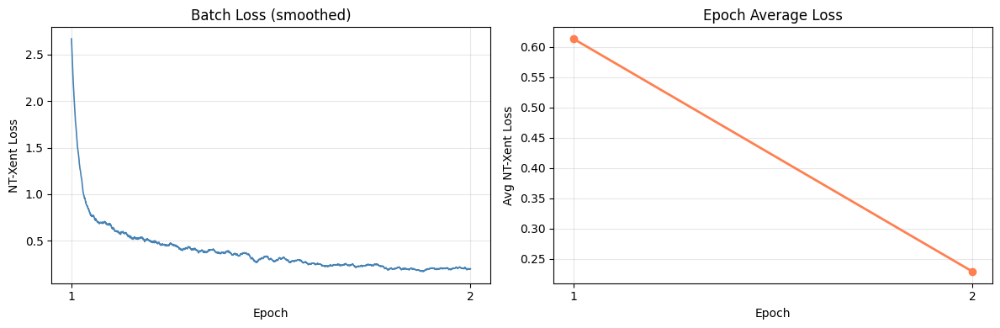

# CLTT: Contrastive Learning with Through Time

Self-supervised pre-training of a video encoder on a single unlabeled video, with linear probe evaluation on UCF-101.

[](https://colab.research.google.com/drive/112ckqCBBv8UqOPj7q4MVXe0YgjwlW4JY?usp=sharing)

## Overview

An R(2+1)D-18 backbone is pre-trained on a single unlabeled soccer broadcast using temporally sampled positive clip pairs under the NT-Xent contrastive objective. The learned representations are evaluated via a linear probe on UCF-101 (101-class action recognition), with the encoder kept frozen throughout evaluation.

## Setup

```
pip install torch torchvision yt-dlp decord av tqdm matplotlib
```

The notebook mounts Google Drive and expects the following directory structure:

```
MyDrive/CLTT_Soccer/
├── frames/
├── checkpoints/
└── ucf101/
```

UCF-101 (`archive.zip`) is available on [Kaggle](https://www.kaggle.com/datasets/matthewjansen/ucf101-action-recognition).

**Expected runtime:** Frame extraction ~5 min · Pre-training ~40 min/epoch · Feature extraction ~2 hrs (A100 GPU)

## Pre-training data

A 3-hour soccer broadcast ([YouTube](https://www.youtube.com/watch?v=gTmR5PMIIjs)), downloaded automatically by the notebook if not already on Drive.

## Reproducibility

Run all cells in `CLTT.ipynb` sequentially. The notebook covers video download and frame extraction, model and loss definitions, pre-training, UCF-101 feature extraction, and linear probe evaluation.

## Method

### Architecture

| Component | Configuration |
|-----------|--------------|
| Backbone | R(2+1)D-18 |
| Projection head | Linear(512→512) → BatchNorm1d → ReLU → Linear(512→128) |
| Loss | NT-Xent (τ = 0.07) |
| Optimizer | AdamW (lr = 3×10⁻⁴, weight decay = 10⁻⁴) |
| LR schedule | CosineAnnealingLR |
| Hardware | Google Colab A100 |

### Clip sampling

Frames are extracted at 5 fps and scaled to 128×128. Each clip is 8 consecutive frames (~1.6 s). A positive pair consists of two clips sampled within a 2 s temporal window (`pos_window = 10 frames` at 5 fps), with a minimum separation of 0.8 s (`min_offset = 4 frames`) to prevent frame overlap between the two clips.

### Augmentation

Applied independently to each clip in a pair:

- RandomCrop (128×128 → 112×112)
- RandomHorizontalFlip
- ColorJitter (brightness=0.4, contrast=0.4, saturation=0.4, hue=0.1)
- Normalization using Kinetics-400 statistics (μ = [0.432, 0.395, 0.376], σ = [0.228, 0.221, 0.217])

### Linear probe

The encoder is frozen and a `Linear(512, 101)` head is trained for 20 epochs using AdamW (lr = 10⁻³, weight decay = 10⁻⁴, batch size 256) on pre-extracted UCF-101 features (train: 209,582 clips; test: 81,743 clips).

## Results

**Pre-training** (2 epochs, 55,075 frames at 5 fps):

| Epoch | Avg NT-Xent Loss |
|-------|-----------------|
| 1     | 0.6132          |
| 2     | 0.2293          |



**Linear probe on UCF-101** (frozen encoder, 101 classes):

| Epoch | Top-1 Accuracy |
|-------|---------------|
| 5     | 21.81%        |
| 10    | 21.23%        |
| 15    | 22.43%        |
| 20    | 23.10%        |

**Baseline: random encoder** (same linear probe, no pre-training):

| Epoch | Top-1 Accuracy |
|-------|---------------|
| 5     | 11.54%        |
| 10    | 11.79%        |
| 15    | 13.26%        |
| 20    | 14.47%        |

| | Top-1 (epoch 20) |
|---|---|
| CLTT pre-trained | 23.10% |
| Random encoder | 14.47% |
| Gain from pre-training | **+8.63 pp** |

## Discussion

Pre-training loss decreases from 0.6132 to 0.2293 across two epochs, showing the model is learning to separate temporally distant clip pairs from proximate ones.

The linear probe reaches 23.10% top-1 accuracy on UCF-101 — well below fully supervised R(2+1)D-18 (75–85%), but well above random chance (~1% over 101 classes). The gap is expected. Pre-training on a single soccer video creates a strong domain mismatch with UCF-101's 101 action categories, most of which have no visual correspondence with soccer footage. Two training epochs compound this.

To isolate what contrastive pre-training contributes from what R(2+1)D-18's convolutional inductive biases provide for free, the same linear probe was run on features from a randomly initialized (untrained) encoder. The random baseline reaches 14.47% — above chance, confirming the architecture itself has some inductive bias toward spatiotemporal structure. CLTT pre-training adds 8.63 percentage points on top of that, a margin cleanly attributable to the contrastive objective and not to the architecture alone.

Extended pre-training and a more diverse video corpus are the most direct paths to closing the gap with supervised baselines.
